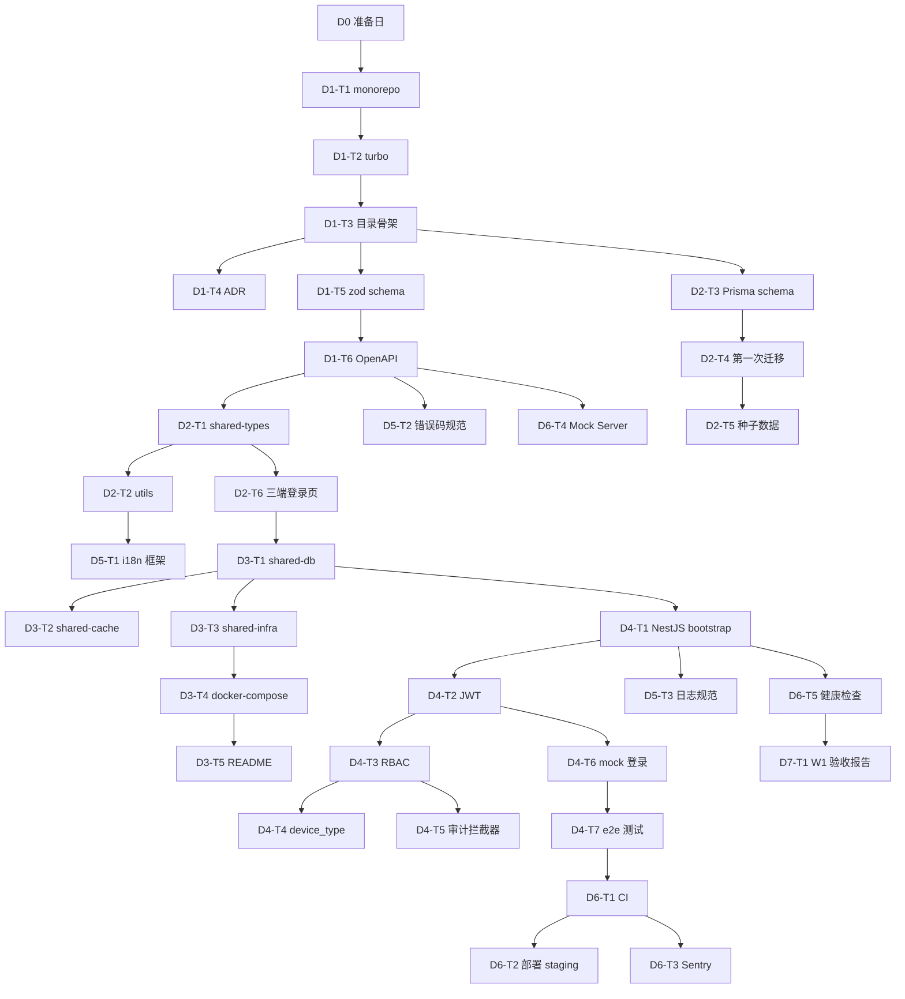

# MeiMart W1 共享前置层 — AI 执行版 (v2)

> **给 AI 的指令**: 本文件是 W1 周(7 个工作日)的可执行任务清单。逐个执行任务,每个任务结束时运行验收命令,通过后标记 ✅。失败时参考 `failure_mode` 回退。如中途被打断,参考"中断恢复"段。

---

## 📋 项目上下文(AI 启动前必读)

```yaml
project: MeiMart
market: 东帝汶 (Asia/Dili UTC+9, 单一市场)
phase: W1 共享前置层 (v2, 7 工作日)
goal: 让 W2 三条业务流程能并行启动
contract_source: Obsidian _inbox/API契约文档-v0.2.md
output_dir: /Users/linsuwei/DevAll/MeiMart  # monorepo 根目录
localization_ref: Obsidian _inbox/MeiMart-东帝汶本地化调研清单-20260617.md

tech_stack:
  monorepo: pnpm workspace + turborepo
  runtime: Node.js 20+
  backend: NestJS 10 + Prisma 5
  database: PostgreSQL 16 + PostGIS 3.4 (用 prisma-raw 适配)
  cache: Redis 7
  api_contract: zod + @asteasolutions/zod-to-openapi
  admin_web: Next.js 14 (App Router) + shadcn/ui + next-intl
  app: React Native + Expo + i18next
  websocket: Socket.IO
  ci: GitHub Actions
  container: Docker Compose
  monitoring: Sentry + pino + 自定义业务指标

payment_methods:
  - COD (货到付款, MVP 主推)
  - 本地银行转账 + 上传凭证 + 人工对账
  - 微信支付 (服务国人游客)
  - PayPal / Stripe (国际支付)

map_service: Google Maps Platform (不用高德/腾讯,覆盖差)
sms: 完全不接短信(+670 号段支持差),用 WhatsApp Business API + 账号密码

i18n:
  required_languages: [en, id, zh, pt]  # 英/印尼/中/葡
  optional_languages: [tet]  # Tetum 留接口,社区翻译
  framework: { web: next-intl, app: i18next }
  fallback: en

business_decisions:
  - 单一商家 (shops 表预置 1 条, 入驻接口留口)
  - 多仓库 (5~10 个, 按地理位置, PostGIS 匹配)
  - 视角切换 (super_admin 同一 JWT, 前端切视角, 后端不感知)
  - 一人全栈 (契约简化, 无 PR 评审, 但有 self-review)
  - MVP 下单走同步事务 + DB 行锁防超卖

team: 1 人 (全栈)
language: 中文 commit message
currency: USD (东帝汶官方货币)
```

---

## ⚙️ 全局约束(AI 必须遵守)

### 1. 目录约束
- 所有命令在 monorepo 根目录 `/Users/linsuwei/DevAll/MeiMart` 执行
- 包名统一 `@meimart/<name>`

### 2. 代码风格
- ESLint + Prettier
- **严禁硬编码字符串**,所有 UI 文案必须用 i18n key
- 函数级 JSDoc,中文注释

### 3. 提交约束
- **分支策略**: main 受保护,所有改动走 feature branch → PR → self-review → squash merge
- 每个 task 完成后单独 commit,中文 message,格式 `[W1-D{n}-T{n}] 简述`
- **数据库 migration 一旦 apply 不能改**,只能新增 migration 修正

### 4. 测试约束
- 关键逻辑必须单测(Vitest),覆盖率门槛 70%
- 鉴权/支付/库存 必须有 e2e 测试

### 5. 失败约束
- 任务失败时**不要重试**,按 `failure_mode` 回退或停下问用户
- 任何阻断 W2 启动的失败 → 立即报告用户

### 6. i18n 约束
- 所有 UI 文案 → `packages/shared-types/locales/<lang>/common.json`
- 后端错误消息 → i18n key 而非直接文案
- 时间/货币/数字格式 → 用 `Intl` API,不要手写

---

## 🔐 外部账号清单(2026-06-18 更新 — MVP 测试阶段精简)

> **重大调整**:MVP 全走个人账号,**所有需要海外主体的服务跳过申请,改 stub/mock**。W1 D0 只启动 3 项。

| 服务                        | W1 D0 是否启动   | 测试阶段方案                        | 后期切真条件         |
| ------------------------- | ------------ | ----------------------------- | -------------- |
| Google Maps Platform      | ✅ **启动**     | 个人 Google 账号 + 国内 Visa/Master | 配额 28k/月够 MVP  |
| 域名                        | ✅ **启动**     | `.com` 注册                     | —              |
| 律师咨询                      | ❌ 跳过         | 东帝汶本地律师                       | —              |
| ~~WhatsApp Business API~~ | ❌ 跳过         | OTP stub(返回 123456)           | 主体到位后申请        |
| ~~FB Business Manager~~   | ❌ 跳过         | 同上                            | 同上             |
| ~~微信支付商户号~~               | ❌ 跳过         | payment mock 返回成功             | 国内个体户挂靠后       |
| ~~PayPal Business~~       | ❌ 跳过         | payment stub 返回成功             | Stripe Atlas 后 |
| ~~Stripe~~                | ❌ 跳过         | payment stub 返回成功             | Atlas LLC 后    |
| ~~阿里云 OSS / AWS S3~~      | ✅ 启动(MVP 必需) | 对象存储无主体门槛                     | —              |
| Sentry                    | ✅ 启动         | 个人账号                          | —              |
| GitHub Actions 部署 ssh key | ✅ 启动         | —                             | —              |

> **测试阶段原则**:**W1 D0 只启动 5 项**(Google Maps、域名、律师、OSS、Sentry),其余服务在 D3-T3 用 mock/stub 实现接口。这把 D0 工作量从 4h 降到 2h,把时间留给契约评审。

---

## 🗺️ 任务依赖 DAG



---

## 📋 任务清单(共 36 个原子任务, 7 天)

---

### D0 — 准备日(W1 启动前一天, 3 任务)

> ⚠️ **2026-06-19 决策:D0 全部跳过**,延后到 W6 处理。
> - D0-T1 外部账号申请:5 项延后(Google Maps / 域名 / OSS / Sentry / 律师),W6-W7 上线前集中申请
> - D0-T2 契约 v0.2 评审:✅ **已完成**(2026-06-18~19),产出 `API契约文档-v0.3.md`,7 个歧义点 + 11 个硬冲突全部决断
> - D0-T3 真实数据准备:延后到 W6,当前阶段全部用 mock/stub + 种子假数据
>
> **当前阶段策略**:全部用 stub/mock,登录用虚拟账号(SmsStrategy/EmailStrategy/WechatStrategy 等返回固定假数据),外部服务接口预留,等 W6 拿到公司主体后再逐个切真。

---

#### `W1-D0-T1` · 启动所有外部账号申请

```yaml
id: W1-D0-T1
title: 启动外部服务账号申请(并行)
estimated: 2h(精简后:Google Maps + 域名 + 律师 + OSS + Sentry 共 5 项)
inputs:
  - MeiMart-东帝汶本地化调研清单
outputs:
  - 各服务申请 ID / 工单号记录在 Obsidian
tasks:
  - Google Maps Platform 申请(个人 Google 账号 + 国内 Visa/Master 信用卡)
  - 域名注册(建议 .com)
  - 阿里云 OSS / AWS S3 开通(个人账号可)
  - Sentry 项目创建(个人账号)
  - 联系东帝汶律师(法律合规),需准备的问题清单:
      * 公司注册地 + 税务(MVP 测试阶段用个人账号,后期补主体路径)
      * 跨境支付合规(测试阶段全 mock,后期切真时合规要求)
      * 电商许可
      * 数据本地化要求(服务器在印尼雅加达,是否合规)
      * 用户协议 / 隐私政策审定
      * 骑手雇佣 vs 合作(劳动法)
      * COD 资金安全责任划分
acceptance:
  - 5 项必启服务已提交申请
  - 律师咨询已发邮件(2-4 周内出意见,W6 末必须有结论)
  - **跳过项**(WhatsApp/微信/PayPal/Stripe)记录在 Obsidian,标注"后期切真条件"
failure_mode: Google Maps 国内信用卡被拒 → 试 UnionPay/Visa 双币卡 / 万事达世界卡
depends_on: []
```

---

#### `W1-D0-T2` · 契约 v0.2 评审

```yaml
id: W1-D0-T2
title: 契约 v0.2 全面评审
estimated: 4h
inputs:
  - Obsidian _inbox/API契约文档-v0.2.md
outputs:
  - MeiMart-契约v0.2评审记录-2026061X.md
check_items:
  - 17 个模块的所有接口字段含义是否清晰
  - warehouse 模块(新增)的字段定义是否完整
  - 多支付方式(COD/银行/微信/PayPal)的订单字段差异
  - 多语言相关字段(如商品名是否多语言)
  - 状态机定义是否完整
  - 错误码是否成体系
acceptance:
  - 所有歧义点列出
  - 每个歧义点决断或标记"待定"
  - 产出 v0.2.1 修订建议(如需)
failure_mode: 重大歧义无法决断 → 找用户拍板,不要进 W1
depends_on: []
```

---

#### `W1-D0-T3` · 真实数据准备启动

```yaml
id: W1-D0-T3
title: 启动真实数据准备(商品/仓库/价格)
estimated: 2h(启动,持续到 W6)
inputs:
  - 商家商品目录(Excel/照片)
outputs:
  - 真实数据录入计划(谁录、何时录完)
considerations:
  - 商品名称需要 4 语言翻译(英/印尼/中/葡)
  - 价格用 USD
  - 商品分类按东帝汶本地习惯
  - 仓库地址 + Google Maps 经纬度
acceptance:
  - 数据录入计划定下来
  - 至少 100 个核心商品 + 3 个仓库数据,在 W6 前录完
failure_mode: 商家没空配合 → 至少准备 50 个示例商品
depends_on: []
```

---

### D1 — 契约落地 + Monorepo 骨架(6 任务)

---

#### `W1-D1-T1` · 创建 monorepo 根目录

```yaml
id: W1-D1-T1
title: 创建 monorepo 根目录与 pnpm workspace
estimated: 30min
inputs: [空目录]
outputs:
  - package.json (root)
  - pnpm-workspace.yaml
  - .gitignore, .nvmrc
commands:
  - mkdir -p /Users/linsuwei/DevAll/MeiMart && cd $_
  - pnpm init
  - 创建 pnpm-workspace.yaml
acceptance:
  - pnpm install 无报错
  - node -v ≥ v20.0.0
failure_mode: Node 版本不足 → nvm use 20
depends_on: []  # D0 已跳过,直接进
```

---

#### `W1-D1-T2` · 配置 Turborepo

```yaml
id: W1-D1-T2
title: Turborepo + TypeScript 基础
estimated: 30min
inputs: [W1-D1-T1]
outputs:
  - turbo.json
  - tsconfig.base.json
commands:
  - pnpm add -Dw turbo typescript @types/node
acceptance: pnpm exec turbo --version 有输出
failure_mode: 网络问题 → 切换 npmmirror
depends_on: [W1-D1-T1]
```

---

#### `W1-D1-T3` · 创建 8 个子包目录骨架

```yaml
id: W1-D1-T3
title: 8 个子包目录骨架
estimated: 1h
inputs: [W1-D1-T2]
outputs:
  - apps/{api,admin-web,client-app,rider-app}
  - packages/{api-contract,shared-types,shared-utils,shared-locales,ui-kit}
note: 增加 shared-locales 包(i18n 翻译)
acceptance: pnpm install 后 @meimart/* 都在 node_modules
failure_mode: workspace 配置错 → 检查 pnpm-workspace.yaml
depends_on: [W1-D1-T2]
```

---

#### `W1-D1-T4` · 编写技术栈 ADR

```yaml
id: W1-D1-T4
title: ADR 架构决策记录
estimated: 30min
inputs: [W1-D1-T3]
outputs:
  - Obsidian _inbox/MeiMart-ADR-技术栈选型-20260617.md
content:
  - 所有技术选型(见 tech_stack)
  - 每项写"为什么选 X / 为什么不选 Y"
  - PostGIS + Prisma 用 prisma-raw 方案
  - 不接短信,用 WhatsApp + 密码
  - 4 种支付方式 + 谁是 MVP 主推
acceptance: 文档存在且 ADR 完整
failure_mode: 无
depends_on: [W1-D1-T3]
```

---

#### `W1-D1-T5` · 把契约 v0.2 + v0.3 转 zod schema (W2 用到的模块)

```yaml
id: W1-D1-T5
title: 契约 v0.2 + v0.3 → zod schema (仅 W2 用到的模块)
estimated: 6h ⚠️ 拉长
inputs:
  - 04-后端记录/API契约文档-v0.2.md (基础契约)
  - 04-后端记录/API契约文档-v0.3.md (变更覆盖,冲突处以此为准)
outputs:
  - packages/api-contract/src/schemas/auth.ts (删 clientType,加 deviceType)
  - packages/api-contract/src/schemas/user.ts
  - packages/api-contract/src/schemas/shop.ts
  - packages/api-contract/src/schemas/warehouse.ts (含 PostGIS GeoJSON Polygon)
  - packages/api-contract/src/schemas/order.ts (基础结构 + orderNo 16 位 + 5 paymentMethod 枚举)
  - 其他模块在各自流程开始前转
key_rules:
  - 金额: z.number().multipleOf(0.01) 或自定义 decimal
  - ID: z.string().uuid()
  - 时间: z.string().datetime()
  - 多语言字段: z.record(z.string(), z.string()) 如 productName: {en, id, zh, pt}
  - warehouse.coverageArea: 用 GeoJSON Polygon 格式
  - 订单号 orderNo: z.string().regex(/^MM\d{8}\d{2}\d{4}$/)  # 16 位
  - JWT payload: { sub, role, deviceType, jti } — 无 clientType
acceptance:
  - pnpm --filter @meimart/api-contract build 无报错
  - 5 个核心 schema 能被 import
failure_mode: 契约有歧义 → 看 v0.3 决策汇总,无答案则停下问用户
depends_on: [W1-D1-T3]
```

---

#### `W1-D1-T6` · zod → OpenAPI 自动生成 + Swagger UI

```yaml
id: W1-D1-T6
title: zod → OpenAPI 生成器 + Swagger UI
estimated: 2h
inputs: [W1-D1-T5]
outputs:
  - packages/api-contract/scripts/gen-openapi.ts
  - packages/api-contract/openapi.yaml (生成)
  - apps/api 的 Swagger UI 入口 (/docs)
commands:
  - pnpm --filter @meimart/api-contract add @asteasolutions/zod-to-openapi
  - pnpm --filter @meimart/api add @nestjs/swagger
acceptance:
  - 访问 http://localhost:3000/docs 看到 Swagger UI
failure_mode: zod-to-openapi 不支持复杂类型 → 简化 schema
depends_on: [W1-D1-T5]
```

---

### D2 — 类型生成 + 工具 + DB schema(6 任务)

---

#### `W1-D2-T1` · shared-types 自动生成

```yaml
id: W1-D2-T1
title: OpenAPI → TS 类型自动生成
estimated: 1h
inputs: [W1-D1-T6]
outputs:
  - packages/shared-types/scripts/gen-types.ts
  - packages/shared-types/src/index.ts
commands:
  - pnpm --filter @meimart/shared-types add openapi-typescript
acceptance:
  - 改 zod 一处 → pnpm gen → 三端编译报错列表准确
failure_mode: 无
depends_on: [W1-D1-T6]
```

---

#### `W1-D2-T2` · shared-utils 工具集

```yaml
id: W1-D2-T2
title: 共享工具集
estimated: 3h ⚠️ 拉长
inputs: [W1-D2-T1]
outputs:
  - packages/shared-utils/src/money.ts (USD 分↔元, 精度处理)
  - packages/shared-utils/src/time.ts (UTC+9, 无夏令时)
  - packages/shared-utils/src/id.ts (UUID v7)
  - packages/shared-utils/src/pagination.ts
  - packages/shared-utils/src/i18n.ts (语言检测 + Intl 格式化)
  - 单测覆盖
acceptance:
  - pnpm --filter @meimart/shared-utils test 通过
  - 覆盖率 ≥ 80%
  - 金额精度测试: 0.1 + 0.2 = 0.3 用整数分实现
failure_mode: 无
depends_on: [W1-D2-T1]
```

---

#### `W1-D2-T3` · Prisma schema + PostGIS 适配方案

```yaml
id: W1-D2-T3
title: Prisma schema 设计 + PostGIS 适配
estimated: 2-3h(2026-06-19 调整:从 4h 缩到 2-3h,因为 Obsidian 草稿已按 v0.3 落地)
inputs:
  - W1-D2-T1
  - **04-后端记录/schema.prisma(v0.3 草稿,作为起点)**
outputs:
  - apps/api/prisma/schema.prisma
  - apps/api/src/shared/db/postgis-helpers.ts (PostGIS raw SQL 封装)

# ====================================================================
# ⚠️ 重要:不要从零写 schema,拷贝草稿作为起点
# ====================================================================
# 草稿位置:/Users/linsuwei/DevAll/Obsidian/Work-Wiki/Work-Wiki/_inbox/04-后端记录/schema.prisma
# 草稿已按 v0.3 决策(7 歧义 + 11 硬冲突 + SMS 反转)全部落地,共 583 行 19+ 张表
#
# 工作流程(必须按此顺序):
commands:
  - cp /Users/linsuwei/DevAll/Obsidian/Work-Wiki/Work-Wiki/_inbox/04-后端记录/schema.prisma apps/api/prisma/schema.prisma
  - **逐表读完草稿**(583 行,含 19+ 张表),理解每个设计的"为什么"
  - **列疑问清单**(看不懂、与契约 v0.3 不一致、PostGIS 使用疑问)
  - **向用户汇报疑问清单,等用户答复后再继续**(保险 1)
  - pnpm --filter @meimart/api add prisma @prisma/client
  - pnpm --filter @meimart/api exec prisma format
  - pnpm --filter @meimart/api exec prisma validate
  - 实现 apps/api/src/shared/db/postgis-helpers.ts(createPoint/findWarehouseByPoint 等)

postgis_strategy:
  - 在 schema.prisma 中 geography 字段用 `Unsupported("geometry(Point,4326)")?`
  - 写入/查询时用 prisma.$queryRaw + ST_SetSRID/ST_MakePoint/ST_Within
  - 封装 helper: createPoint(lon, lat), findWarehouseByPoint(point), createPolygon(coords)
  - **GIST 空间索引必须走 raw SQL migration**(prisma schema 不支持空间索引语法):
    1. `prisma migrate dev --create-only --name init`(在 D2-T4 跑)
    2. 手改生成的 SQL,在 CREATE TABLE warehouses 后加:
       `CREATE INDEX idx_warehouses_coverage_gist ON "warehouses" USING GIST ("coverage_area");`
       `CREATE INDEX idx_warehouses_center_gist ON "warehouses" USING GIST ("center_point");`
    3. `prisma migrate dev` 应用
    4. 此 migration 与 init 同批做,避免 W2 流程 2 下单匹配仓库时全表扫描

tables:  # 16 张基线表(v0.3),草稿已全部包含
  - User (含 deviceType 字段,删 clientType)
  - UserRole (5 个真实角色:super_admin/customer/rider/warehouse_staff/customer_service)
  - Shop (单一商家, 预置 1 条)
  - Warehouse (含 centerPoint Point + coverageArea Polygon + GIST 索引)
  - Product (含 name/description i18n JSON: Record<string,string>)
  - Sku
  - Stock (warehouseId + skuId 复合唯一,行锁防超卖)
  - **StockLog** (库存变更日志,含 warehouse_id 维度,W3 流程 1 inventory 需要)
  - Order (含 warehouseId,orderNo 16 位 MM+yyyyMMdd+wh2+seq4)
  - OrderItem, OrderEvent (状态机事件)
  - AuditLog (含 perspective + deviceType 字段)
  - **PaymentIntent** (表名 payment_intents, paymentMethod 5 枚举 COD/BANK/WECHAT/PAYPAL/STRIPE)
  - **IdempotencyKey** (幂等键,W2 流程 2 order/payment 回调防重)
  - **RiderLocation** (骑手当前位置,UPSERT)
  - **RiderLocationHistory** (骑手历史轨迹,每个订单一份,完成时归档)

# ====================================================================
# 3 道保险 — 防止盲跑出错(2026-06-19 加)
# ====================================================================
acceptance:
  # 保险 1:review 草稿
  - 已向用户汇报疑问清单并获答复(草稿与契约 v0.3 冲突点已澄清)
  # 基础验证
  - pnpm --filter @meimart/api prisma format 无报错
  - pnpm --filter @meimart/api prisma validate 通过
  # 保险 3:PostGIS helper 单测(testcontainers 真实容器)
  - PostGIS helper 单测通过(用 testcontainers 起 postgis/postgis:16-3.4 容器,**禁止 mock PostGIS 函数**,否则看不出真实查询行为)
  - EXPLAIN findWarehouseByPoint 查询走索引(预先手动建 GIST 索引验证)
  # 业务逻辑校验
  - orderNo 生成器单测通过(验证 16 位格式 + 跨日重置 + 单仓单日上限 9999)
  - JWT payload 类型校验:含 deviceType 无 clientType
  # 16 张表清单核对
  - 草稿拷贝后,\dt 显示所有表与 v0.3 决策的 16 张基线表一致

# 保险 2 在 D2-T4 任务执行(看 SQL 再 apply)

failure_mode:
  - Prisma 不识别 Unsupported → 升级 prisma 5.10+
  - **拷贝后发现草稿与契约 v0.3 有冲突 → 停下问用户,不要擅自改 schema**
  - PostGIS helper 单测失败 → 检查 raw SQL 中 ST_SetSRID 参数顺序(lon, lat 不能颠倒)
depends_on: [W1-D2-T1]
```

---

#### `W1-D2-T4` · 第一次数据库迁移

```yaml
id: W1-D2-T4
title: 起 postgres+postgis 容器,执行第一次迁移(含 GIST 索引)
estimated: 1-1.5h(2026-06-19 调整:加 SQL review 节点)
inputs: [W1-D2-T3]
outputs:
  - apps/api/prisma/migrations/*/migration.sql

# ====================================================================
# 保险 2(2026-06-19 加):init migration SQL 必须用户 review
# ====================================================================
# 不要直接跑 prisma migrate dev 让它自动 apply,要分两步:
#   1. --create-only 生成 SQL → 给用户看
#   2. 用户确认 GIST 索引位置正确后,再 apply
commands:
  - docker run -d --name meimart-pg -e POSTGRES_PASSWORD=dev -p 5432:5432 postgis/postgis:16-3.4
  - pnpm --filter @meimart/api exec prisma migrate dev --create-only --name init
  - **打开 apps/api/prisma/migrations/{timestamp}_init/migration.sql 检查**
  - **手动在 SQL 末尾追加**(如果 prisma 没自动生成):
      CREATE INDEX IF NOT EXISTS idx_warehouses_coverage_gist
        ON "warehouses" USING GIST ("coverage_area");
      CREATE INDEX IF NOT EXISTS idx_warehouses_center_gist
        ON "warehouses" USING GIST ("center_point");
  - **把最终 SQL 文件路径告诉用户,等用户答复"确认 apply"后再继续**
  - pnpm --filter @meimart/api exec prisma migrate dev(应用)

acceptance:
  - psql 连接成功, \dt 显示所有表(≥ 16 张基线表)
  - SELECT PostGIS_Version(); 有输出
  - SELECT indexname FROM pg_indexes WHERE tablename = 'warehouses'; 显示两个 GIST 索引
  - EXPLAIN SELECT * FROM warehouses WHERE ST_Within(ST_MakePoint(125.5, -8.5), coverage_area);
    显示 "Index Scan using idx_warehouses_coverage_gist"(不是 Seq Scan)

failure_mode:
  - PostGIS 扩展缺失 → 手动 CREATE EXTENSION postgis;
  - GIST 索引创建失败 → 检查 coverage_area 字段是否真的有 geometry 类型(不是 Json)
  - prisma migrate 报错 Unsupported 字段 → 确认 prisma 5.10+ 已安装
depends_on: [W1-D2-T3]
```
```

---

#### `W1-D2-T5` · 种子数据脚本

```yaml
id: W1-D2-T5
title: 种子数据
estimated: 2h ⚠️ 拉长(PostGIS 数据生成)
inputs: [W1-D2-T4]
outputs:
  - apps/api/prisma/seed.ts
data:
  - 1 个 super_admin
  - 1 条 shop 记录
  - 3 个 warehouses (各含 Point + Polygon,用真实东帝汶坐标)
  - 10 个 products (名称含 4 语言 i18n) + 20 个 SKUs
  - 每个商品在每个仓库各 1 条 stock 记录
acceptance:
  - pnpm --filter @meimart/api db:seed 无报错
  - 用 super_admin 能 mock 登录
failure_mode: PostGIS 数据生成错 → 用 PostGIS helper 函数
depends_on: [W1-D2-T4]
```

---

#### `W1-D2-T6` · 三端登录页(纯 UI,i18n key 化)

```yaml
id: W1-D2-T6
title: 三端登录页 UI + i18n
estimated: 3h ⚠️ 拉长(i18n 接入)
inputs: [W1-D2-T1]
outputs:
  - apps/admin-web/app/login/page.tsx
  - apps/client-app/screens/Login.tsx
  - apps/rider-app/screens/Login.tsx
key_points:
  - 所有文案用 i18n key,不硬编码
  - 表单字段类型来自 @meimart/shared-types
  - 三端 UI 各自适配(Web/RN)
acceptance:
  - 三端登录页能渲染,文案能切换 4 种语言
  - 英语为默认 fallback
failure_mode: RN 起不来 → Expo Go 真机调试
depends_on: [W1-D2-T1]
```

---

### D3 — 基建封装 + Docker(5 任务)

---

#### `W1-D3-T1` · shared-db 封装

```yaml
id: W1-D3-T1
title: Prisma client 单例 + 事务封装
estimated: 1h
inputs: [W1-D2-T4]
outputs:
  - apps/api/src/shared/db/prisma.ts
  - apps/api/src/shared/db/transaction.ts
acceptance:
  - import { db } from '@/shared/db' 可用
  - 事务抛错时自动回滚
failure_mode: 无
depends_on: [W1-D2-T4]
```

---

#### `W1-D3-T2` · shared-cache 封装

```yaml
id: W1-D3-T2
title: Redis 封装 + 会话 + 限流
estimated: 2h
inputs: [W1-D3-T1]
outputs:
  - apps/api/src/shared/cache/redis.ts
  - apps/api/src/shared/cache/session.ts
  - apps/api/src/shared/cache/rate-limit.ts
commands:
  - pnpm --filter @meimart/api add ioredis
acceptance:
  - redis.set/get 跑通
  - 限流计数器在 100 并发下准确
failure_mode: 无
depends_on: [W1-D3-T1]
```

---

#### `W1-D3-T3` · shared-infra 封装(Google Maps + 多支付 stub + 多 OTP stub)

```yaml
id: W1-D3-T3
title: 外部 SDK 封装(Google Maps 真实 + Payment/OTP 全 mock)
estimated: 4h ⚠️ 拉长(策略多,但 mock 实现简单)
inputs: [W1-D3-T1]
outputs:
  - apps/api/src/infrastructure/map/google-maps.ts (🟡 stub:Google Maps key 延后到 W6 申请,先用固定假数据返回)
  - apps/api/src/infrastructure/payment/payment-strategy.ts (抽象接口)
  - apps/api/src/infrastructure/payment/cod.strategy.ts (✅ 真实流程:骑手送达确认)
  - apps/api/src/infrastructure/payment/bank-transfer.strategy.ts (✅ 真实流程:凭证 + 人工对账)
  - apps/api/src/infrastructure/payment/wechat.strategy.ts (🟡 mock:返回假支付成功)
  - apps/api/src/infrastructure/payment/paypal.strategy.ts (🟡 stub:返回假支付成功)
  - apps/api/src/infrastructure/payment/stripe.strategy.ts (🟡 stub:返回假支付成功,接口预留)
  - apps/api/src/infrastructure/otp/otp-strategy.ts (抽象接口)
  - apps/api/src/infrastructure/otp/password.strategy.ts (✅ 真实:bcrypt 哈希,主登录)
  - apps/api/src/infrastructure/otp/sms.strategy.ts (🟡 stub:固定返回 123456,手机验证,W6 切本地 Timor Telecom/Telkomcel)
  - apps/api/src/infrastructure/otp/email.strategy.ts (✅ 真实:Nodemailer + MailHog/SendGrid,找回密码)
  - apps/api/src/infrastructure/otp/whatsapp.strategy.ts (🟡 stub:固定返回 123456,W6 申请 Business API)
  - apps/api/src/infrastructure/oss/minio.ts (dev) / oss.ts (prod,延后到 W6)
key_design:
  - 所有外部服务通过 interface 抽象,可替换实现
  - 支付策略统一接口: createPayment, refund, queryStatus
  - OTP 策略统一接口: sendCode, verifyCode
  - mock/stub 实现必须日志标注 "[MOCK]" / "[SMS_STUB]" 前缀,便于排查
  - dev/staging/prod 三种环境配置走 .env,切换支付方式只改 PAYMENT_STRATEGY 环境变量
  - mock 数据要逼真:返回真实的 transactionId 格式、状态码、回调结构
  - **登录链路优先级**:密码(主) → SMS 手机验证(次) → 邮箱找回(兜底)
acceptance:
  - 所有 SDK 通过 interface 抽象
  - 5 个支付策略(2 真实 + 3 mock)+ 4 个 OTP 策略(2 真实 + 2 mock)实现完成
  - 切换策略只改 .env,不改代码
  - 日志能区分真实/mock 调用
  - 虚拟登录跑通(任意密码都成功,因为 PasswordStrategy 在测试模式 mock verify)
failure_mode: 无
depends_on: [W1-D3-T1]
```

---

#### `W1-D3-T4` · docker-compose.yml

```yaml
id: W1-D3-T4
title: docker-compose 一键起本地全栈
estimated: 1h
inputs: [W1-D3-T3]
outputs:
  - docker-compose.yml
services:
  - postgres(postgis/postgis:16-3.4)
  - redis(redis:7-alpine)
  - minio(minio/minio)
  - mailhog(mailhog/mailhog)
  - backup-cron(pg_dump 定时备份,每小时)
acceptance:
  - docker compose up -d 全部 healthy
  - docker compose down 清理干净
  - 备份 cron 正常工作(检查 backups/ 目录)
failure_mode: 端口冲突 → 改端口映射
depends_on: [W1-D3-T3]
```

---

#### `W1-D3-T5` · 根 README 本地启动指南

```yaml
id: W1-D3-T5
title: 根 README
estimated: 30min
inputs: [W1-D3-T4]
outputs:
  - README.md
sections:
  - 环境要求 (Node 20+, Docker, pnpm)
  - 外部账号准备清单(链接到调研清单)
  - 一键启动 (docker compose up + pnpm install + db:migrate + db:seed)
  - 各 app 启动命令
  - 常见问题排查
acceptance:
  - 新机器按 README 跑,30 分钟内能起本地环境
failure_mode: 无
depends_on: [W1-D3-T4]
```

---

### D4 — Gateway + 鉴权 + 视角切换(7 任务)

---

#### `W1-D4-T1` · NestJS bootstrap + 全局拦截器

```yaml
id: W1-D4-T1
title: NestJS 启动 + 全局过滤器/拦截器/pipe/日志/trace_id
estimated: 2h
inputs: [W1-D3-T1]
outputs:
  - apps/api/src/main.ts
  - apps/api/src/shared/filters/all-exceptions.filter.ts
  - apps/api/src/shared/interceptors/logging.interceptor.ts
  - apps/api/src/shared/interceptors/trace-id.interceptor.ts
acceptance:
  - 所有请求带 X-Trace-Id header
  - 异常返回统一结构 { code, message, traceId, i18nKey }
failure_mode: 无
depends_on: [W1-D3-T1]
```

---

#### `W1-D4-T2` · JWT 签发与校验

```yaml
id: W1-D4-T2
title: access_token + refresh_token
estimated: 1.5h
inputs: [W1-D4-T1]
outputs:
  - apps/api/src/modules/auth/jwt.service.ts
  - apps/api/src/modules/auth/strategies/jwt.strategy.ts
commands:
  - pnpm --filter @meimart/api add @nestjs/jwt @nestjs/passport passport passport-jwt
config:
  - access_token 有效期: 客户端 30 天 / 骑手 12h / 后台 2h
  - refresh_token 有效期: 60 天
  - JWT 密钥从环境变量读,强度 ≥ 32 字符
acceptance:
  - 签发的 token 在 jwt.io 可解出 userId/role/deviceType
  - 过期 token 返回 401
failure_mode: 无
depends_on: [W1-D4-T1]
```

---

#### `W1-D4-T3` · RBAC guard + @Roles 装饰器

```yaml
id: W1-D4-T3
title: 角色守卫与装饰器
estimated: 1h
inputs: [W1-D4-T2]
outputs:
  - apps/api/src/shared/decorators/roles.decorator.ts
  - apps/api/src/shared/guards/roles.guard.ts
acceptance:
  - @Roles('super_admin') 装饰器可用
  - 无角色调用 → 403
failure_mode: 无
depends_on: [W1-D4-T2]
```

---

#### `W1-D4-T4` · device_type 中间件

```yaml
id: W1-D4-T4
title: 拒绝跨端调用中间件
estimated: 30min
inputs: [W1-D4-T3]
outputs:
  - apps/api/src/shared/middleware/device-type.middleware.ts
rules:
  - /api/client/* 必须 device_type=app_client
  - /api/rider/* 必须 device_type=app_rider
  - /api/admin/* 必须 device_type=web_admin
acceptance:
  - client token 调 admin → 403
  - 同端 token 调本端 → 通过
failure_mode: 无
depends_on: [W1-D4-T3]
```

---

#### `W1-D4-T5` · 审计日志拦截器(视角切换核心)

```yaml
id: W1-D4-T5
title: 写操作自动审计
estimated: 3h ⚠️ 拉长(视角切换设计复杂)
inputs: [W1-D4-T3]
outputs:
  - apps/api/src/shared/decorators/audit.decorator.ts
  - apps/api/src/shared/interceptors/audit.interceptor.ts
key_design:
  - 视角不进 JWT,后端不感知视角
  - 所有写操作(POST/PUT/PATCH/DELETE)自动记录 before/after
  - perspective 字段从 X-Perspective header 读取(前端发送)
  - **前端注入方式**:fetch/axios interceptor 从 zustand 读 perspective,自动加 `X-Perspective` header;切换视角时所有后续请求自动带上
  - 审计日志统一写 AuditLog 表
  - sensitive fields 自动 mask(如 password)
acceptance:
  - super_admin 任意写操作 → AuditLog 新增
  - 字段: userId/action/resource/resourceId/before/after/perspective/ip
  - 密码等敏感字段不进日志
failure_mode: 无
depends_on: [W1-D4-T3]
```

---

#### `W1-D4-T6` · mock 登录端点

```yaml
id: W1-D4-T6
title: 三端 mock 登录(仅 dev/staging)
estimated: 1h
inputs: [W1-D4-T2]
outputs:
  - apps/api/src/modules/auth/mock-login.controller.ts
endpoint: POST /auth/mock-login
body: { role, deviceType }
guard: NODE_ENV !== 'production'
acceptance:
  - 三端各自能拿到 token
  - 生产环境调用 → 404
failure_mode: 无
depends_on: [W1-D4-T2]
```

---

#### `W1-D4-T7` · 端到端鉴权测试

```yaml
id: W1-D4-T7
title: 鉴权链路 e2e 测试
estimated: 2h ⚠️ 拉长
inputs: [W1-D4-T6]
outputs:
  - apps/api/test/auth.e2e-spec.ts
test_cases:
  - mock 登录 → 调保护接口 → 200
  - client token → 调 admin → 403
  - 过期 token → 401
  - super_admin 写操作 → AuditLog 有记录
  - 敏感字段不进 AuditLog
acceptance: 所有测试通过
failure_mode: 无
depends_on: [W1-D4-T6]
```

---

### D5 — i18n + 错误码 + 日志规范(3 任务)

---

#### `W1-D5-T1` · i18n 框架接入

```yaml
id: W1-D5-T1
title: 三端 i18n 框架接入 + 英语翻译
estimated: 4h
inputs: [W1-D2-T2]
outputs:
  - packages/shared-locales/structure.md (翻译 key 规范)
  - packages/shared-locales/en/common.json
  - apps/admin-web/i18n 配置 (next-intl)
  - apps/client-app/i18n 配置 (i18next)
  - apps/rider-app/i18n 配置 (i18next)
key_rules:
  - 命名: namespace.section.key (如 auth.login.title)
  - 英语为 baseline,先翻译英语
  - 其他语言在 W2-W4 各流程中翻译
  - 用户语言偏好检测: 浏览器 locale → App locale → 用户设置
acceptance:
  - 三端切换语言能正确显示英语
  - 缺失 key fallback 到英语
  - **覆盖范围**:W2 流程 1/2/3 启动所需文案,~120 key
    (auth 登录注册 / user 资料 / shop 商家信息 / warehouse 仓库 / order 订单 / payment 支付 4 策略 / 通用错误提示)
failure_mode: 无
depends_on: [W1-D2-T2]
```

---

#### `W1-D5-T2` · 错误码规范

```yaml
id: W1-D5-T2
title: 统一错误码体系
estimated: 2h
inputs: [W1-D1-T6]
outputs:
  - packages/shared-types/src/error-codes.ts
  - packages/shared-locales/en/errors.json
format: E-<MODULE>-<NUMBER> (如 E-AUTH-001, E-ORDER-042)
categories:
  - E-AUTH-* (认证授权)
  - E-USER-* (用户)
  - E-CATALOG-* (商品)
  - E-WAREHOUSE-* (仓库)
  - E-ORDER-* (订单)
  - E-PAYMENT-* (支付)
  - E-DISPATCH-* (配送)
  - E-RIDER-* (骑手)
  - E-IM-* (消息)
  - E-NOTIFY-* (通知)
  - E-SETTLE-* (结算)
  - E-PLATFORM-* (平台)
  - E-COMMON-* (通用)
acceptance:
  - 所有错误码有对应 i18n key
  - 后端抛错用错误码,不直接抛文案
  - 前端根据错误码查 i18n 显示
failure_mode: 无
depends_on: [W1-D1-T6]
```

---

#### `W1-D5-T3` · 日志规范

```yaml
id: W1-D5-T3
title: pino 日志字段与级别规范
estimated: 1h
inputs: [W1-D4-T1]
outputs:
  - apps/api/src/shared/logger/logger.config.ts
  - 文档: MeiMart-日志规范-2026061X.md
spec:
  levels: trace/debug/info/warn/error/fatal
  required_fields: [timestamp, level, traceId, userId?, action]
  sampled_fields: [request_body, response_body (only debug)]
  sensitive_mask: [password, token, phone (last 4), idCard (last 4)]
  production_level: info
  dev_level: debug
acceptance:
  - 所有日志带 traceId
  - 敏感字段自动 mask
  - 日志格式 JSON 结构化
failure_mode: 无
depends_on: [W1-D4-T1]
```

---

### D6 — CI/CD + Mock Server + 可观测(5 任务)

---

#### `W1-D6-T1` · GitHub Actions CI

```yaml
id: W1-D6-T1
title: 主 CI 流水线
estimated: 2h ⚠️ 拉长(monorepo + multi-app)
inputs: [W1-D4-T7]
outputs:
  - .github/workflows/ci.yml
jobs:
  - quality: lint + typecheck + test (parallel by package)
  - contract: zod → openapi 校验
  - security: pnpm audit --high
  - build: 4 个 app 各自构建 Docker 镜像
acceptance:
  - PR 提交触发 CI
  - 任一 job 失败挡 merge
  - pnpm audit 高危依赖挡 merge
failure_mode: 无
depends_on: [W1-D4-T7]
```

---

#### `W1-D6-T2` · 自动部署 staging

```yaml
id: W1-D6-T2
title: merge to main 自动部署
estimated: 2h ⚠️ 拉长(单机部署脚本)
inputs: [W1-D6-T1]
outputs:
  - .github/workflows/deploy.yml
  - scripts/deploy-staging.sh
flow:
  - 触发: push to main
  - 步骤: build → ssh staging → docker compose pull → up -d → health check → smoke test
acceptance:
  - merge PR 后 10 分钟内,staging 可访问新版本
  - 部署失败自动回滚到上一版本
failure_mode: ssh key 未配置 → 提示加 GitHub Secrets
depends_on: [W1-D6-T1]
```

---

#### `W1-D6-T3` · Sentry 接入

```yaml
id: W1-D6-T3
title: Sentry 错误监控
estimated: 30min
inputs: [W1-D6-T1]
outputs:
  - apps/api/src/shared/monitoring/sentry.ts
  - apps/admin-web/sentry.config.ts
acceptance:
  - 故意抛错 → Sentry dashboard 收到事件
  - 事件带 traceId
failure_mode: 无 Sentry 账号 → 跳过,记录 TODO
depends_on: [W1-D6-T1]
```

---

#### `W1-D6-T4` · Mock Server

```yaml
id: W1-D6-T4
title: 基于 OpenAPI 起 Mock Server
estimated: 1.5h ⚠️ 拉长(prism 配置)
inputs: [W1-D1-T6]
outputs:
  - packages/api-contract/mock-server.ts
commands:
  - pnpm --filter @meimart/api-contract add @stoplight/prism-cli
acceptance:
  - pnpm --filter @meimart/api-contract mock 启动
  - 三端能拿到符合契约的 mock 响应
  - PostGIS 类型 mock 数据正确
failure_mode: prism 不支持 PostGIS → 简化 schema
depends_on: [W1-D1-T6]
```

---

#### `W1-D6-T5` · 健康检查 + 备份验证

```yaml
id: W1-D6-T5
title: /health 与 /ready + 备份验证
estimated: 1h
inputs: [W1-D4-T1]
outputs:
  - apps/api/src/modules/health/health.controller.ts
endpoints:
  - GET /health → 进程存活(总是 200)
  - GET /ready → 依赖就绪检查(db/redis)
acceptance:
  - docker compose up 后,/ready 在 30s 内变 200
  - 故意停 redis → /ready 返回 503
  - 验证 pg_dump 备份能 restore(端到端跑一遍)
  - 备份失败 → Sentry 收到 alert(在 cron 脚本末尾加 exit code 检查)
failure_mode: 无
depends_on: [W1-D4-T1]
```

---

### D7 — 收尾 + 验收(1 任务)

---

#### `W1-D7-T1` · W1 验收报告 + buffer

```yaml
id: W1-D7-T1
title: 写 W1 验收报告 + 处理 buffer 任务
estimated: 6h
inputs: [所有 W1 任务]
outputs:
  - Obsidian _inbox/MeiMart-W1验收报告-2026062X.md
sections:
  - 任务完成情况(36 个 task 状态)
  - 验收清单勾选
  - 风险与遗留问题
  - W2 启动门评估
buffer_usage:
  - 如果 D1-D6 有未完成任务,用 D7 补
  - 如果全部完成,D7 写文档 + 优化代码 + 准备 W2
  - **超时砍刀清单**(按顺序砍,优先保 W2 启动门):
    1. D6-T4 Mock Server(W2 各流程自建 mock 顶)
    2. D6-T3 Sentry(W2-W3 接,Console 顶)
    3. D5-T3 日志规范文档(代码已实现,文档后补)
    4. D3-T5 README(W2 边做边补)
  - **W2 启动最低门槛**(不能砍):鉴权 + 契约 + DB schema + 三端登录页 + docker compose + i18n 基础
acceptance:
  - 所有验收项 ✅
  - 报告归档
failure_mode: 任一验收项 ❌ → 不进 W2,补救计划补在报告里
depends_on: [所有 W1 任务]
```

---

## ✅ W1 全局验收清单(D7 必须全勾)

### 基础设施
```
□ pnpm install && pnpm dev 4 个 app 能起
□ Swagger UI 显示所有 W2 用到的接口
□ docker compose up 一键起 postgres(postgis)+redis+minio+mailhog
□ pg_dump 备份定时任务工作
□ 14 张基线表已迁移(含 StockLog/PaymentIntent/IdempotencyKey),种子数据可登录
□ coverageArea GIST 索引已建(EXPLAIN 走索引,非全表扫描)
□ Mock Server 本地可访问
```

### 鉴权与安全
```
□ mock 登录三端可用,JWT 含 deviceType
□ RBAC + device_type + audit 三道闸门 e2e 测试通过
□ 视角切换设计落地(后端不感知,前端待 W2 实现)
□ 密码强度规则: ≥ 8 位 + 字母+数字
□ JWT 密钥强度 ≥ 32 字符,从环境变量读
□ 敏感字段自动 mask(密码/手机号/身份证)
□ CORS 白名单配置正确
□ pnpm audit 无高危依赖
```

### 国际化
```
□ i18n 框架接入三端
□ 英语翻译完整(W2 用到的部分)
□ 错误码体系 + i18n key 对应
□ 时间/货币格式用 Intl,无硬编码
```

### 支付与外部服务
```
□ 4 种支付方式策略模式抽象(COD/银行/微信/PayPal)
□ OTP 策略抽象(WhatsApp/密码)
□ Google Maps SDK 封装完成
□ dev 环境 WhatsApp/PayPal/微信支付 全 mock
□ WhatsApp Business API 申请已启动
```

### 可观测与运维
```
□ Sentry 接入,trace_id 贯穿
□ pino 结构化日志
□ /health 与 /ready 端点
□ CI 全绿
□ merge to main 自动部署 staging
□ 部署失败自动回滚
```

### 性能基线
```
□ 健康检查响应 < 50ms
□ mock 登录响应 < 200ms
□ Swagger UI 加载 < 2s
□ 数据库连接池配置合理(max 10)
```

### 文档
```
□ ADR 归档
□ W1 验收报告归档
□ 日志规范归档
□ 错误码规范归档
□ 东帝汶本地化调研清单状态更新
```

**任一项未达标 → 不进 W2**,在 W1 验收报告里补补救计划。

---

## 🚨 风险预警表(v2 增补)

| # | 风险 | 触发 task | 影响 | 预案 |
|---|---|---|---|---|
| 1 | **WhatsApp API 申请未到位** | ~~W1-D0-T1~~ → 跳过 | ~~W2 auth 没法测~~ → 用 stub | OTP 接口预留 stub(返回 123456),密码 + 邮箱够 MVP |
| 2 | **Google Maps 申请慢/被拒** | W1-D0-T1 | W3 仓库匹配没法测 | 临时用 OpenStreetMap + Nominatim |
| 3 | **契约 v0.2 有重大歧义** | W1-D0-T2 | 阻断 D1-T5 | D0 决断,产出 v0.2.1 |
| 4 | **PostGIS + Prisma 兼容性** | W1-D2-T3 | D2 拖到 D3 | 锁定 prisma-raw 方案,必要时退化为 GeoHash |
| 5 | **法律合规未确认**(MVP 用个人账号) | W1-D0-T1 | W8 不能上线 | D0 启动律师咨询,W6 末必须有结论;**测试阶段不真实收款**规避大部分风险 |
| 6 | **印尼雅加达到东帝汶网络** | W1-D6-T2 | 联调时延大 | W1 D6 部署后实测,< 100ms 可接受 |
| 7 | **i18n 翻译资源不足** | W1-D5-T1 | W2-W4 各流程卡 | 英语先翻完,其他语言社区众包 |
| 8 | **视角切换设计被业务推翻** | W1-D4-T5 | D4 重做 | D4 内决断,不带病进 W5 |
| 9 | **NestJS 太重** | W1-D4-T1 | D4 拖到 D5 | 退到 Fastify,补 0.5 天 |
| 10 | **Mock Server 不够真实** | W1-D6-T4 | 三端抱怨 | 优先补下单/接单/配送三条链路 mock |
| 11 | **单人 7 天工作量大**(W1 总 74h) | 全 W1 | 任务完不成 | D7 砍刀清单兜底(Sentry/Mock Server 可推 W2) |
| 12 | **数据备份未验证** | W1-D3-T4 | 数据丢失无救 | D6-T5 必须做 restore 演练 |
| 13 | **🆕 无海外主体,支付 mock 化** | 全局 | 上线后不能真实收款 | 测试阶段用 COD(真实)+ 银行转账(真实),微信/PayPal/Stripe stub,W7 上线前决断补主体 |
| 14 | **🆕 Google Maps 个人 key 配额 28k/月** | 全局 | 高峰期限流 | DAU 5000 估算够用,加缓存 + 客户端按需加载 |

---

## 🔄 中断恢复说明

如果 AI 中途被打断,恢复时按以下步骤:

```
1. 检查 git log 看最近 commit:
   git log --oneline | head -20
   
2. 找到最后一个 [W1-D{n}-T{n}] commit,确定下一步 task id

3. 运行该 task 的 acceptance 命令验证状态

4. 如果通过 → 进下一个 task
   如果未通过 → 重做当前 task

5. 如果 git log 看不到 [W1-*] commit:
   - 说明 W1 还没开始,从 D0-T1 开始
   - 或检查是否有未 commit 的改动 (git status)
```

---

## 📦 W1 输出物总览

```
代码仓库(/Users/linsuwei/DevAll/MeiMart):
├── apps/
│   ├── api/             # NestJS,鉴权+mock 登录已通,i18n 接入
│   ├── admin-web/       # Next.js,登录页 + i18n
│   ├── client-app/      # RN,登录页 + i18n
│   └── rider-app/       # RN,登录页 + i18n
├── packages/
│   ├── api-contract/    # zod 源 + OpenAPI + Mock Server
│   ├── shared-types/    # 自动生成 + 错误码
│   ├── shared-utils/    # 工具 + 单测
│   ├── shared-locales/  # i18n 翻译(英语完整)
│   └── ui-kit/          # shadcn 二次封装
├── docker-compose.yml   # postgres+postgis+redis+minio+mailhog+backup
├── prisma/migrations/   # 12+ 张基线表
├── prisma/seed.ts       # 种子数据(含 PostGIS)
├── turbo.json
└── .github/workflows/   # ci.yml + deploy.yml

文档(/Users/linsuwei/DevAll/Obsidian/Work-Wiki/Work-Wiki/_inbox):
├── MeiMart-ADR-技术栈选型-20260617.md
├── MeiMart-W1验收报告-2026062X.md
├── MeiMart-日志规范-2026061X.md
├── MeiMart-契约v0.2评审记录-2026061X.md
├── MeiMart-东帝汶本地化调研清单-20260617.md (持续更新)
└── (已有)其他文档
```

---

## 🎯 给 AI 的最终指令

```
1. 读取本文件全文 + MeiMart-东帝汶本地化调研清单,理解项目上下文
2. 先确认 D0 准备日任务:外部账号申请是否启动?契约评审是否完成?
3. 按 D0 → D1 → ... → D7 顺序执行任务
4. 每完成一个 task:
   a. 运行所有 acceptance 命令
   b. 全部通过 → git commit -m "[W1-D{n}-T{n}] 简述"
   c. 任一失败 → 看 failure_mode,无预案则停下问用户
5. D7 收尾时,填写 W1 验收报告
6. 验收清单全勾 → 提示用户"W1 完成,可进 W2"
7. 验收清单有未勾 → 不进 W2,在报告里补补救计划
8. 中途被打断 → 按"中断恢复"段流程恢复
```
